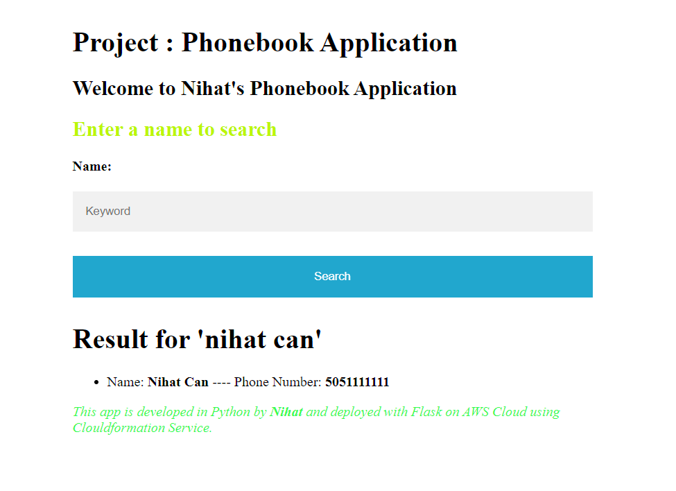

DOCKER COMPOSE PROJECT

 Description: 
 Phonebook Application, I aimed to build a phonebook application in Python and deploy it as a web applicatio usig Docker-compose.

Outcome:

Search page

Add page 

Delete page

Update page

NOTE: All you have to do is run "docker-compose up" command.